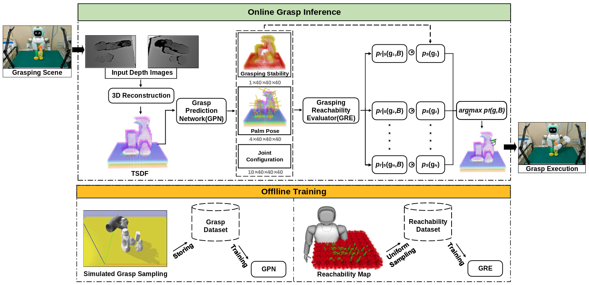

# Walker 6-DoF Grasping

This repository contains the implementation of 6-DoF General Object Grasping for WalkerII Humanoid Robot with Multi-fingered hands. The overview of our grasping framework is shown below:



The relevant publication is listed as follows:

* Zhuo Li, Shiqi Li, Ke Han, Xiao Li, Youjun Xiong, and Zheng Xie. Planning Multi-fingered Grasps with Reachability Awareness in Unrestricted Workspace. Journal of Intelligent & Robotic Systems, 2022. [[PDF](https://www.zhuoli-academic.com/wp-content/plugins/pdfjs-viewer-shortcode/pdfjs/web/viewer.php?file=https://www.zhuoli-academic.com/wp-content/uploads/2022/07/JINT-D-22-00199.pdf&attachment_id=1007&dButton=true&pButton=true&oButton=false&sButton=true#zoom=auto&pagemode=none&_wpnonce=170cdad185) ] [[Video](https://youtu.be/V6NAbrddj7E)] 

The next sections provide instructions for getting started with our work.

- [Walker 6-DoF Grasping](#walker-6-dof-grasping)
  - [Installation](#installation)
  - [Data Generation](#data-generation)
    - [Raw Data Generation](#raw-data-generation)
    - [Raw Data Clean](#raw-data-clean)
    - [Dataset Construction](#dataset-construction)
  - [Network Training](#network-training)
  - [Simulated Grasping](#simulated-grasping)
  - [Real-world Robotic Grasping](#real-world-robotic-grasping)
    - [Dependencies](#dependencies)
    - [Start the Robot](#start-the-robot)
    - [Hand-eye Calibration](#hand-eye-calibration)
    - [Grasp Prediction](#grasp-prediction)
    - [Grasp Execution](#grasp-execution)

## Installation

The following instructions were tested with `python3.8` on Ubuntu 20.04. A ROS installation is only required for visualizations and interfacing hardware. Simulations and network training should work just fine without. The [Real-world Robotic Grasping](#real-world-robotic-grasping) section describes the setup for real-robot grasping experiments in more details.

OpenMPI is optionally used to distribute the data generation over multiple cores/machines.

```
sudo apt install libopenmpi-dev
```

Clone the repository into the `src` folder of a catkin workspace.

```
git clone https://github.com/RIP4KOBE/walker_6dof_grasping.git
```

Create and activate a new virtual environment.

```
cd /path/to/walker_6dof_grasping
python3 -m venv --system-site-packages .venv
source .venv/bin/activate
```

Install the Python dependencies within the activated virtual environment.

```
pip install -r requirements.txt
```

Build and source the catkin workspace,

```
catkin build walker_6dof_grasping
source /path/to/catkin_ws/devel/setup.bash

gedit ~/.bashrc
export PYTHONPATH="/path/to/walker_6dof_grasping/src"
```

## Data Generation

### Raw Data Generation

Generate raw synthetic grasping trials using the [pybullet](https://github.com/bulletphysics/bullet3) physics simulator.

```
python scripts/generate_data.py data/raw/foo --sim-gui
```

* `python scripts/generate_data.py -h` prints a list with all the options.
* `mpirun -np <num-workers> python ...` will run multiple simulations in parallel.

The script will create the following file structure within `data/raw/foo`:

* `grasps.csv` contains the configuration, label, and associated scene for each grasp,
* `scenes/<scene_id>.npz` contains the synthetic sensor data of each scene.

### Raw Data Clean

```
python scripts/raw_grasp_data_clean.py
```

The script is useful to clean and balance the generated grasp data.

### Dataset Construction

```
python scripts/construct_dataset.py data/raw/foo data/datasets/foo
```

* The script will generate the voxel grids/grasp targets required to train GPN.
* Samples of the dataset can be visualized with the `vis_sample.py` script and `gpn.rviz` configuration. The script includes the option to apply a random affine transform to the input/target pair to check the data augmentation procedure.

## Network Training

```
python scripts/train_gpn.py --dataset data/datasets/foo [--augment]
```

Training and validation metrics are logged to TensorBoard and can be accessed with

```
tensorboard --logdir data/runs
```

## Simulated Grasping

Run simulated clutter removal experiments.

```
python scripts/sim_grasp.py --model data/models/walker2_model/gpn_conv_1545.pt --sim-gui --rviz

```

* `python scripts/sim_grasp.py -h` prints a complete list of optional arguments.
* To visualize the predicted grasps, you need to run the following code:
```
cd /path/to/walker_6dof_grasping/config/
rviz -d sim.rviz
```
* Use the `clutter_removal.ipynb` notebook to compute metrics and visualize failure cases of an experiment.

## Real-world Robotic Grasping

This section contains the implementation of our method on physical WalkerII humanoid service robot.

### Dependencies
[easy_handeye](https://github.com/IFL-CAMP/easy_handeye)

[aruco_ros](https://github.com/pal-robotics/aruco_ros)

[realsense_ros](https://github.com/IntelRealSense/realsense-ros)

[walker_kinematics_solver](https://github.com/RIP4KOBE/walker_kinematics_solver)


### Start the Robot

First, you need to start the WalkerII robot with the following conmands:

- launch walker_control
```
ssh walker2@192.168.11.2
aa
sudo -s
roslaunch walker_control walker_control.launch 
```
- launch whole_body_control
```
ssh walker2@192.168.11.2
aa
sudo -s
aa
cd ~/run
./autorun.sh
```
-  launch service
```
rosservice call /walker/controller/enable "data: true"
 ```
-  launch legs
```
ssh walker2@192.168.11.2
aa
sudo -s
aa
roslaunch leg_motion walker2_leg.launch
```

### Hand-eye Calibration
Next, Using [easy_handeye](https://github.com/IFL-CAMP/easy_handeye) package to perform the hand-eye calibration (Note that you can use other hand-eye calibration methods, as long as you get the correct transformation relationship between the robot hand coordinate and the camera coordinate): 
- Attach the Aruco Marker to the palm of the robot hand.
- Launch the camera
```
cd path/to/realsense_ros
roslaunch realsense2_camera rs2_camera.launch
```
- Launch easy_handeye
```
cd path/to/easy_handeye
roslaunch easy_handeye walker_aruco_calib_realsense.launch
```
- Sampling around 20 group of poses and recording the trasnformation matrix


### Grasp Prediction
- Launch the camera
```
cd path/to/realsense_ros
roslaunch realsense2_camera rs2_camera.launch
```
- Predicting Feasible Grasps
```
cd path/to/walker_6dof_grasping
source .venv/bin/activate
python scripts/walker_detection_single_cam.py --model data/models/walker2_model/vgn_conv_1545.pt 
```
- Visualizing Prediction Results
```
cd path/to/walker_6dof_grasping/config
rviz -d sim.rviz 
```
### Grasp Execution
- IK Solving and Reachable Grasps Publishing 
```
cd path/to/walker_kinematics_solver
rosrun grasp_pose_ik_solver
```

- Grasp Execution
```
cd path/to/walker_kinematics_solver
rosrun walker_grasp
```
Remember to set the motion_segment flag as true when you first run the walker_grasp.cpp
```
line 548 bool motion_segment0 = true;
```
